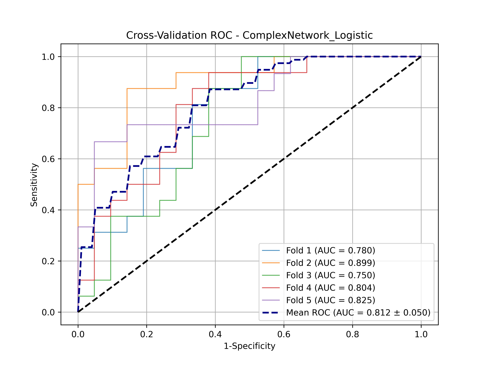
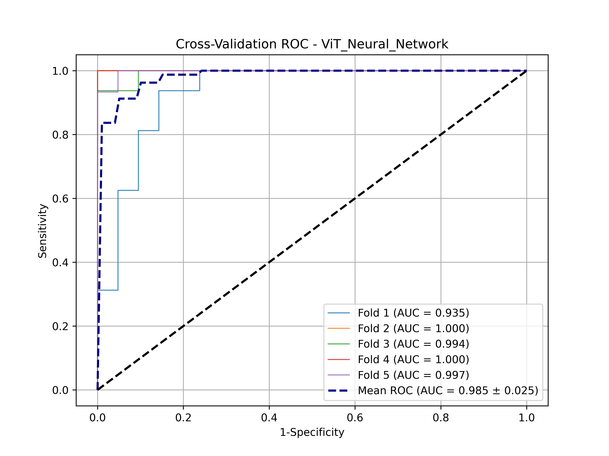
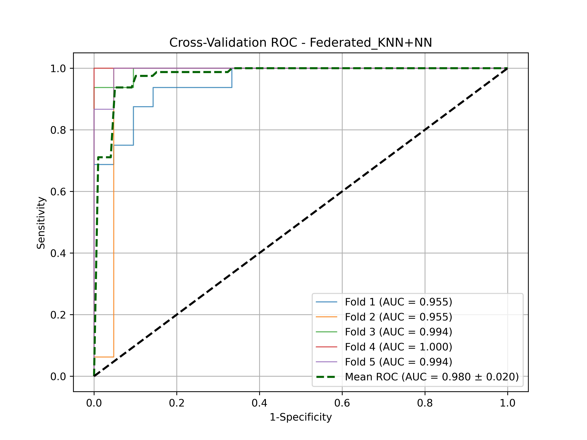

# ASD-ViT-Diagnostic
This is the official repository for the implementation of ViT features in the manuscript "Vision Transformer and Complex Network Analysis for Autism Spectrum Disorder Classification in T1 Structural MRI"

## Updating

# Features
The vit_final_features.csv and complex_final_features.csv contains the features generated and screened in the paper. 

To generate ViT features on ones own please watch the repository. we are building the software to support extracting AI features from medical imagings. You can also review another project https://github.com/xycjscs/CCTA-based-myocardial-radiomics.git, to generate Resnet152 Features. One can replace resnet with ViT pretrined model to generate ViT features for each brain regions.

# Train the models
To train the CNA(logistic), ViT(NN), and Federated model CNA(KNN)-ViT(NN) as introduced in the paper, run the following code.
```bash
python train.py
```

After the excution, ROC plots will be generated as shown in the plots folts.

### CNA(logistic) ROC


### ViT(NN) ROC


### Federated model CNA(KNN)-ViT(NN)

